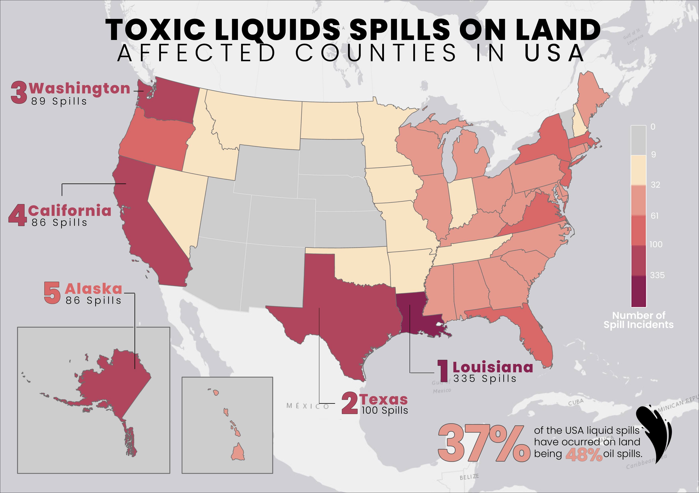
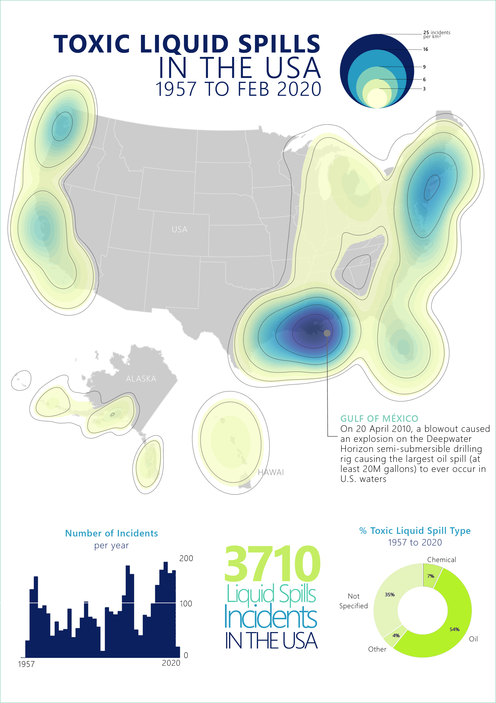

# Oil Spills Interactive Map
 An interactive map for visualizing oil spills by category and oil spills risk in the U.S.
 demo: http://oilspill.c1.biz/

Also, some infographics for summarising the data and highlighting some insights.

  
